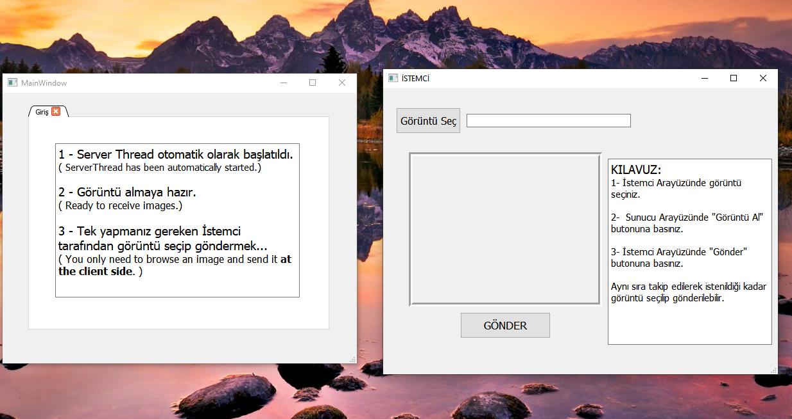
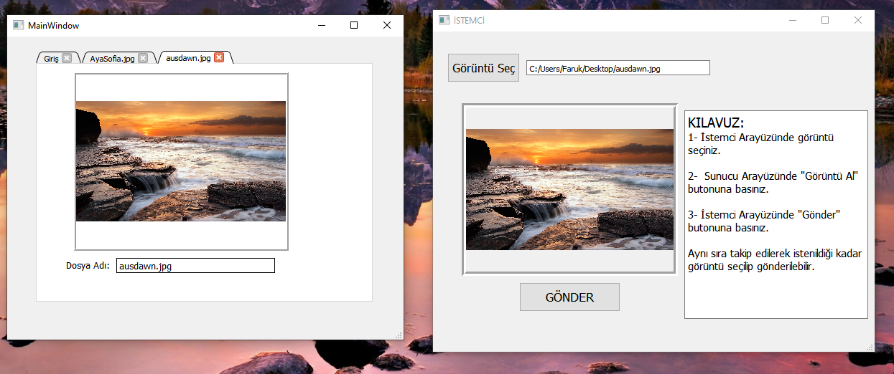

# UDPFileTransfer

* Implements UDP protocol in order to send/recv images. Client is sending image file to Server.

* Görüntü gönderip-almak için UDP protokolü gerçeklenmiştir.

Bu tasarımda İstemci, Sunucuya görüntü dosyası göndermektedir.

# Uygulamalar - Başlangıç Durumu:

# Uygulamalar - Gönderi Durumu:

